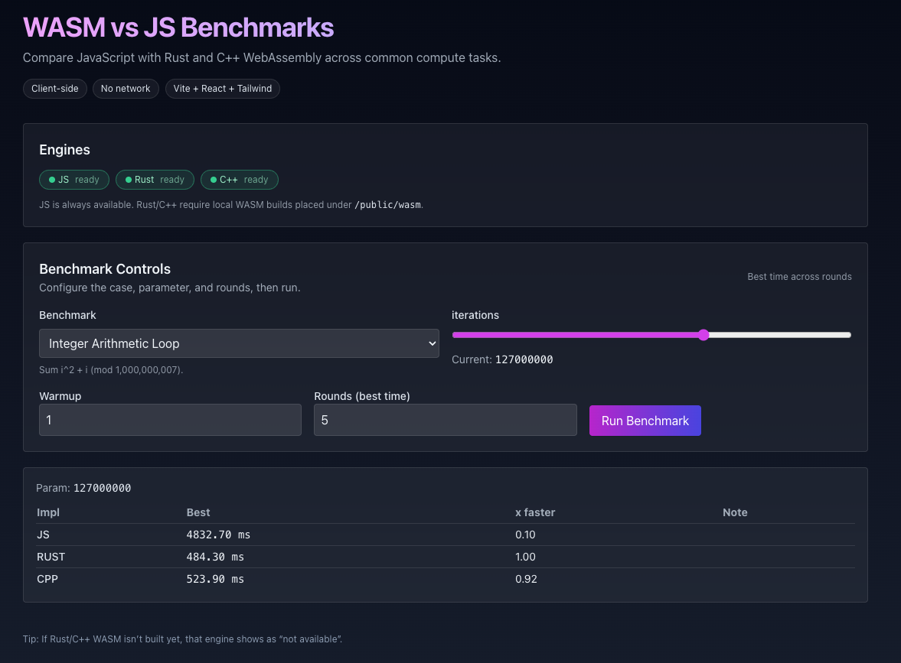

# WASM vs JS Benchmarks

Compare JavaScript with Rust and C++ WebAssembly across common compute tasks. Built with Vite + React + Tailwind. Rust is compiled via wasm-bindgen (wasm-pack), and C++ via Emscripten.

## Screenshot



## Features

- Side-by-side JS, Rust (WASM), and C++ (WASM) implementations
- Live controls for case, parameter, warmup, and rounds
- Best-time selection across rounds with stable micro-benchmarking
- Responsive progress UI with spinner, per-phase text, and gradient bar
- Modern dark UI with subtle glassmorphism and gradients

## Benchmarks

- Fibonacci (iterative): `fib(n)` — u32 wrapping semantics
- Prime Sieve: `prime_sieve(n)` — count primes ≤ n
- Integer Arithmetic Loop: `arith_loop(iterations)` — accumulate (i² + i) mod 1e9+7
- Matrix Multiply: `matmul(size)` — checksum of A×B (mod 1e9+7)

## How It Works

- WASM wrappers are served from `public/` and loaded at runtime to respect Vite’s rule that JS in `public/` cannot be imported from source code.
- Rust loader dynamically imports the wrapper JS by full URL and passes the resolved `.wasm` URL to `init()`.
- C++ loader imports the Emscripten ES module by URL and uses `cwrap` to expose functions.

## Getting Started

- Node.js 18+
- Rust toolchain + `wasm-pack`
- Emscripten SDK (for C++)

## Install and Run

```bash
npm install

# Build WASM (optional if you only want JS)
npm run wasm:rust
npm run wasm:cpp
# or both
npm run wasm:all

# Start dev server
npm run dev
```

## WASM Build Outputs

- Rust (wasm-pack target web): `public/wasm/rust/pkg/wasm_benches.js`, `public/wasm/rust/pkg/wasm_benches_bg.wasm`
- C++ (Emscripten, ES module): `public/wasm/cpp/benchmark.js`, `public/wasm/cpp/benchmark.wasm`

## Project Structure

- `src/bench/` — JS implementations and the benchmark runner
- `src/components/` — React UI
- `src/wasm/` — Rust/C++ runtime loaders
- `wasm/rust/` — Rust sources (wasm-bindgen)
- `wasm/cpp/` — C++ sources (Emscripten)
- `public/wasm/` — Place built WASM artifacts here

## Implementation Notes

- Vite does not transform files in `public/`. To avoid the import-analysis error, loaders build a full URL at runtime and call `import(/* @vite-ignore */ url)` so the browser fetches the module directly.
- For very fast functions, each round repeats until a minimum wall time (~10ms) is reached, then divides by repetitions to get an average per-call time. Tiny results are shown in µs.

## Troubleshooting

- “Cannot import non-asset file … inside /public”: This is expected. Use the provided loaders; do not import `public/` assets directly from source.
- If Rust/C++ show as “n/a”, ensure you’ve built and copied the WASM outputs into `public/wasm/...` using the scripts above.

## License

Licensed under the Apache License, Version 2.0. See `LICENSE` for details.
